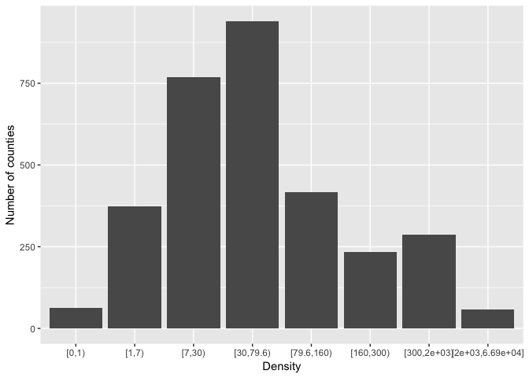
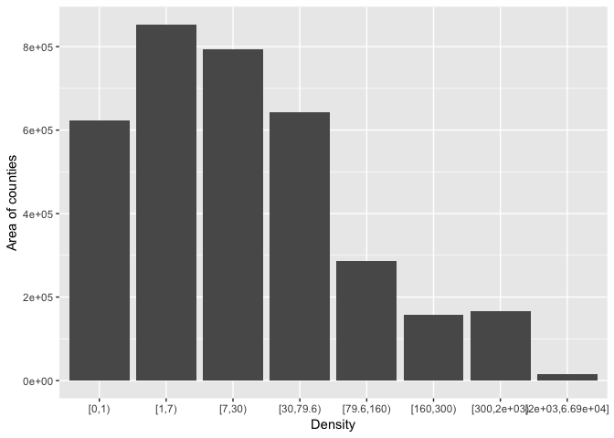
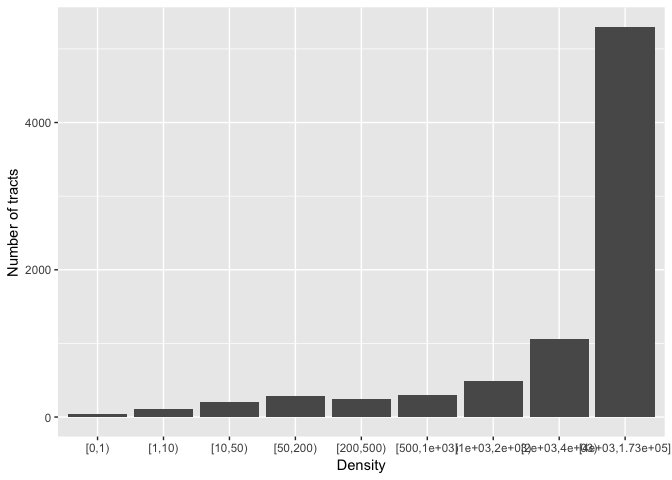
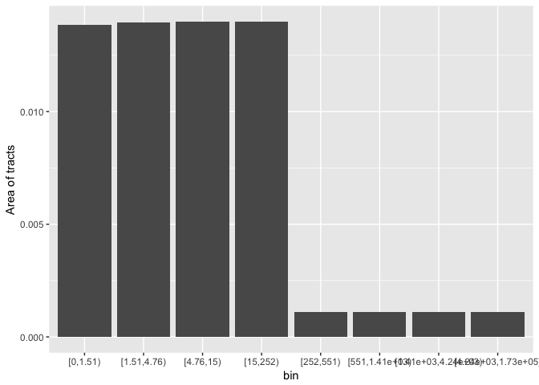
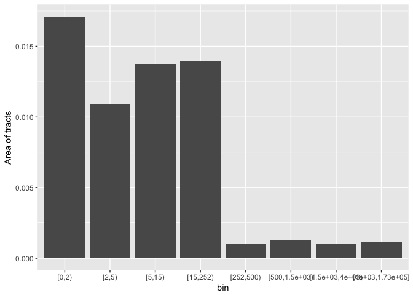
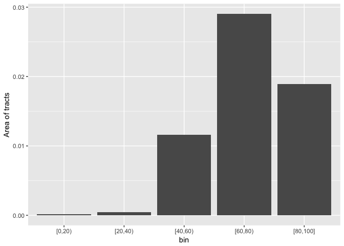
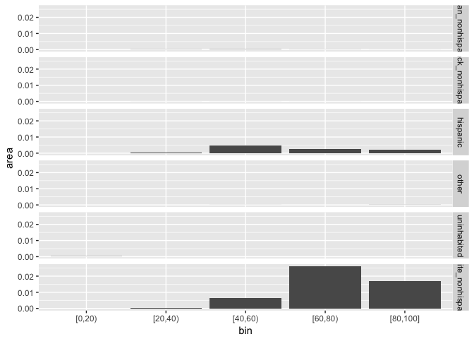

Map design
================
Bill Behrman
2017-10-25

-   [Brewer 2000 US population density](#brewer-2000-us-population-density)
    -   [Average density](#average-density)
    -   [Bins](#bins)
-   [Bostock 2014 California population density](#bostock-2014-california-population-density)
-   [Equal area breaks](#equal-area-breaks)
-   [Average density divide](#average-density-divide)
-   [Race and ethnicty bins](#race-and-ethnicty-bins)

``` r
# Libraries
library(tidyverse)
library(sf)
library(stringr)

# Parameters
  # ACS Year
ACS_YEAR <- "2015"
  # Boundaries year
BOUNDARIES_YEAR <- "2016"
  # State FIPS
STATE_FIPS <- "06"  # California
  # EPSG code for WGS84 coordinate reference system
EPSG_WGS84 <- 4326L
  # Number of square meters in a square mile
SQ_METER_SQ_MILE <- 1609.344 ^ 2
  # Overall population density of California in 2016
CA_DENSITY <- 39250017 / (403501101370 / SQ_METER_SQ_MILE)
  # API query for 2000 census county population and area
api_county_2000 <- "https://api.census.gov/data/2000/sf1?get=NAME,P001001,AREALAND,AREAWATR&for=county:*"
  # Base API query for ACS 5-year population estimates
api_base <- str_c("https://api.census.gov/data/", ACS_YEAR, "/acs5?get=GEOID,NAME,B03001_001E,B03002_003E,B03001_003E,B03002_006E,B03002_004E")
  # API queries for ACS 5-year population estimates
api_query <- c(
  county             = str_c(api_base, "&for=county:*&in=state:", STATE_FIPS),
  county_subdivision = str_c(api_base, "&for=county+subdivision:*&in=state:", STATE_FIPS),
  tract              = str_c(api_base, "&for=tract:*&in=state:", STATE_FIPS)
)
  # URLs for US Census Bureau boundary shape files
url_boundaries <-  c(
  county             = str_c("https://www2.census.gov/geo/tiger/GENZ", BOUNDARIES_YEAR, "/shp/cb_", BOUNDARIES_YEAR, "_us_county_500k.zip"),
  county_subdivision = str_c("https://www2.census.gov/geo/tiger/GENZ", BOUNDARIES_YEAR, "/shp/cb_", BOUNDARIES_YEAR, "_", STATE_FIPS, "_cousub_500k.zip"),
  tract              = str_c("https://www2.census.gov/geo/tiger/GENZ", BOUNDARIES_YEAR, "/shp/cb_", BOUNDARIES_YEAR, "_", STATE_FIPS, "_tract_500k.zip")
)
  # Temp directory
dir_tmp <- "tmp/"

#===============================================================================

# Get 2000 census county data
v <- jsonlite::fromJSON(api_county_2000)
colnames(v) <- v[1, ]
county_2000 <- 
  v %>% 
  .[-1, ] %>% 
  as_tibble() %>% 
  mutate_at(vars(P001001), as.integer) %>% 
  mutate_at(vars(AREALAND, AREAWATR), as.double) %>% 
  select(
    state,
    county,
    name       = NAME,
    population = P001001,
    area_land  = AREALAND,
    area_water = AREAWATR
  )

# Group percentage of total
group_pct <- function(group, total) {
  as.integer(round(if_else(total == 0L, 0, 100 * (group / total))))
}

# Largest group
largest_group <- function(
  white_nonhispanic, hispanic, asian_nonhispanic, black_nonhispanic, other
) {
  if (all(white_nonhispanic == 0L, hispanic == 0L, asian_nonhispanic == 0L,
          black_nonhispanic == 0L, other == 0L)) {
    "uninhabited"
  } else {
    c(
      white_nonhispanic = white_nonhispanic,
      hispanic          = hispanic,
      asian_nonhispanic = asian_nonhispanic,
      black_nonhispanic = black_nonhispanic,
      other             = other
    ) %>% 
      which.max(.) %>%
      names()
  }
}
  
# Get ACS population estimates
get_population <- function(region) {
  v <- jsonlite::fromJSON(api_query[[region]])
  colnames(v) <- v[1, ]
  v %>% 
    .[-1, ] %>% 
    as_tibble() %>% 
    mutate_at(vars(starts_with("B03")), as.integer) %>%
    mutate(
      NAME =
        NAME %>% 
          str_replace(", \\w+$", "") %>% 
          str_replace("[ ]+CCD[ ]*,", ",") %>% 
          str_replace("[ ]*,[ ]*", "\n"),
      population        = B03001_001E,
      white_nonhispanic = B03002_003E,
      hispanic          = B03001_003E,
      asian_nonhispanic = B03002_006E,
      black_nonhispanic = B03002_004E,
      other = population - white_nonhispanic - hispanic -
                asian_nonhispanic - black_nonhispanic,
      white_pct    = group_pct(group = B03002_003E, total = B03001_001E),
      hispanic_pct = group_pct(group = B03001_003E, total = B03001_001E),
      asian_pct    = group_pct(group = B03002_006E, total = B03001_001E),
      black_pct    = group_pct(group = B03002_004E, total = B03001_001E),
      other_pct =
        if_else(population == 0L, 0L,
                pmax(0L, 100L - white_pct - hispanic_pct -
                     asian_pct - black_pct)),
      largest_group =
        list(
          white_nonhispanic = B03002_003E,
          hispanic          = B03001_003E,
          asian_nonhispanic = B03002_006E,
          black_nonhispanic = B03002_004E,
          other             = B03001_001E - B03002_003E - B03001_003E -
                                B03002_006E - B03002_004E
        ) %>%
        pmap_chr(largest_group),
      largest_pct =
        pmax(white_pct, hispanic_pct, asian_pct, black_pct, other_pct)
    ) %>% 
    select(geoid = GEOID, name = NAME, population:largest_pct) %>% 
    arrange(geoid)
}

# Get US Census Bureau boundaries
get_boundaries <- function(region) {
  
  # Download and unzip US Census Bureau shapefile
  url <- url_boundaries[[region]]
  dest <- str_c(dir_tmp, region, ".zip")
  if (download.file(url = url, destfile = dest, quiet = TRUE)) {
    stop(str_c("Error: Download for ", region, " failed"))
  }
  unzip(zipfile = dest, exdir = str_c(dir_tmp, region))
  
  # Read shapefile into sf object, filter to state, and convert to WGS84 
  # coordinate reference system
  st_read(
    dsn = str_c(dir_tmp, region),
    quiet = TRUE,
    stringsAsFactors = FALSE
  ) %>%
    rename_all(tolower) %>% 
    filter(statefp == STATE_FIPS) %>% 
    arrange(geoid) %>% 
    st_transform(crs = EPSG_WGS84)
}

# Create temp directory
if (!file.exists(dir_tmp)) {
  dir.create(dir_tmp, recursive = TRUE)
}

# Get data for each region
acs <- 
  names(api_query) %>% 
  map_dfr(
    ~(
      get_boundaries(.x) %>% 
        filter(aland > 0) %>%
        mutate(affgeoid = str_replace(affgeoid, "00US", "US")) %>% 
        select(-name) %>% 
        left_join(get_population(.x), by = c("affgeoid" = "geoid")) %>% 
        as_tibble() %>% 
        mutate(
          region = .x,
          density = population / aland * SQ_METER_SQ_MILE,
          area_land = aland / SQ_METER_SQ_MILE
        ) %>% 
        select(
          region, 
          geoid, 
          name, 
          population, 
          area_land,
          density, 
          white_nonhispanic:largest_pct,
          -geometry
        ) %>% 
        arrange(geoid)
    )
  )

# Remove temporary directory
if (unlink(dir_tmp, recursive = TRUE, force = TRUE)) {
  print("Error: Remove temporary directory failed")
}
```

Brewer 2000 US population density
=================================

Average density
---------------

``` r
county_2000 %>% 
  summarize_at(vars(population, area_land, area_water), sum) %>% 
  transmute(
    density_land  = population / area_land * SQ_METER_SQ_MILE,
    density_total = population / (area_land + area_water) * SQ_METER_SQ_MILE
  )
```

    ## # A tibble: 1 x 2
    ##   density_land density_total
    ##          <dbl>         <dbl>
    ## 1     79.55528      74.17389

Brewer used land area.

Bins
----

``` r
county_2000 <- 
  county_2000 %>% 
  mutate(density = population / area_land * SQ_METER_SQ_MILE)

brewer_breaks <- c(0, 1, 7, 30, 79.6, 160, 300, 2000, max(county_2000$density))

county_2000 <- 
  county_2000 %>% 
  mutate(
    bin = cut(
      density,
      breaks = brewer_breaks,
      include.lowest = TRUE,
      right = FALSE,
      ordered_result = TRUE
    )
  )

v <- 
  county_2000 %>% 
  group_by(bin) %>% 
  summarize(
    n = n(),
    area = sum(area_land) / SQ_METER_SQ_MILE
  )

v %>% 
  ggplot(aes(bin, n)) + 
  geom_col() +
  labs(x = "Density", y = "Number of counties")
```



``` r
v %>% 
  ggplot(aes(bin, area)) + 
  geom_col() +
  labs(x = "Density", y = "Area of counties")
```



Bostock 2014 California population density
==========================================

Bins used for [map](https://bl.ocks.org/mbostock/670b9fe0577a29c39a1803f59c628769).

``` r
v1 <- 
  acs %>%
  filter(region == "tract")

bostock_breaks <- c(0, 1, 10, 50, 200, 500, 1000, 2000, 4000, max(v1$density))

v2 <- 
  v1 %>% 
  mutate(
    bin = cut(
      density,
      breaks = bostock_breaks,
      include.lowest = TRUE,
      right = FALSE,
      ordered_result = TRUE
    )
  ) %>% 
  group_by(bin) %>% 
  summarize(
    n = n(),
    area = sum(area_land) / SQ_METER_SQ_MILE
  )

v2 %>% 
  ggplot(aes(bin, n)) + 
  geom_col() +
  labs(x = "Density", y = "Number of tracts")
```



``` r
v2 %>% 
  ggplot(aes(bin, area)) + 
  geom_col() +
  labs(x = "Density", y = "Area of tracts")
```


Equal area breaks
=================

``` r
acs %>%
  filter(region == "tract", density < CA_DENSITY) %>% 
  arrange(density) %>% 
  mutate(cum_area = cumsum(area_land) / sum(area_land)) %>% 
  select(density, cum_area) %>% 
  filter(
    near(cum_area, 0.25, 0.01) |
    near(cum_area, 0.50, 0.01) |
    near(cum_area, 0.75, 0.01)
  )
```

    ## # A tibble: 21 x 2
    ##      density  cum_area
    ##        <dbl>     <dbl>
    ##  1  1.248830 0.2443873
    ##  2  1.506422 0.2484039
    ##  3  1.531814 0.2535154
    ##  4  4.673983 0.4932414
    ##  5  4.747737 0.4983640
    ##  6  4.778979 0.5021710
    ##  7  4.858921 0.5023277
    ##  8  5.223747 0.5039008
    ##  9  5.224692 0.5066251
    ## 10 14.345220 0.7421994
    ## # ... with 11 more rows

``` r
acs %>% 
  filter(region == "tract", density >= CA_DENSITY) %>% 
  arrange(density) %>% 
  mutate(cum_area = cumsum(area_land) / sum(area_land)) %>% 
  select(density, cum_area) %>% 
  filter(
    near(cum_area, 0.25, 0.001) |
    near(cum_area, 0.50, 0.001) |
    near(cum_area, 0.75, 0.001)
  )
```

    ## # A tibble: 27 x 2
    ##      density  cum_area
    ##        <dbl>     <dbl>
    ##  1  550.8173 0.2493966
    ##  2  552.9632 0.2505440
    ##  3 1406.8323 0.4993440
    ##  4 1407.7990 0.4994842
    ##  5 1409.2411 0.4998045
    ##  6 1411.0361 0.5002698
    ##  7 1415.1566 0.5008533
    ##  8 1415.3320 0.5009992
    ##  9 4217.8882 0.7491209
    ## 10 4218.5474 0.7491579
    ## # ... with 17 more rows

``` r
break_areas <- function(breaks, df, var) {
  bin_var <- enquo(var)
  df %>% 
    mutate(
      bin = cut(
        !!(bin_var),
        breaks = breaks,
        include.lowest = TRUE,
        right = FALSE,
        ordered_result = TRUE
      )
    ) %>% 
  group_by(bin) %>% 
  summarize(
    n = n(),
    area = sum(area_land) / SQ_METER_SQ_MILE
  ) %>% 
  ggplot(aes(bin, area)) + 
  geom_col() +
  labs(y = "Area of tracts")
}

c(0, 1.51, 4.76, 15, CA_DENSITY, 551, 1410, 4240.5, max(v1$density)) %>% 
  break_areas(v1, density)
```



``` r
c(0, 2, 5, 15, CA_DENSITY, 500, 1500, 4000, max(v1$density)) %>% 
  break_areas(v1, density)
```



Average density divide
======================

``` r
CA_DENSITY
```

    ## [1] 251.9375

``` r
acs %>%
  filter(region == "tract") %>% 
  arrange(density) %>% 
  mutate(
    cum_area = cumsum(area_land) / sum(area_land),
    cum_population = cumsum(population) / sum(population)
  ) %>% 
  filter(near(density, CA_DENSITY, 1)) %>%
  select(density, cum_area, cum_population)
```

    ## # A tibble: 4 x 3
    ##    density  cum_area cum_population
    ##      <dbl>     <dbl>          <dbl>
    ## 1 251.9330 0.9271688     0.06995803
    ## 2 252.1876 0.9273414     0.07013447
    ## 3 252.5072 0.9275105     0.07030758
    ## 4 252.5699 0.9278050     0.07060920

California tracts below the average population density account for almost 93% of the land area but less than 7% of the population.

Race and ethnicty bins
======================

``` r
v1 %>% 
  filter(largest_pct > 0) %>% 
  pull(largest_pct) %>% 
  summary()
```

    ##    Min. 1st Qu.  Median    Mean 3rd Qu.    Max. 
    ##   23.00   50.00   62.00   62.78   75.00  100.00

``` r
v1 %>% 
  filter(largest_pct > 0) %>%
  filter(largest_pct == min(largest_pct)) %>% 
  mutate(name = stringr::str_replace(name, "\\n", " ")) %>% 
  knitr::kable()
```

| region | geoid       | name                                 |  population|  area\_land|   density|  white\_nonhispanic|  hispanic|  asian\_nonhispanic|  black\_nonhispanic|  other|  white\_pct|  hispanic\_pct|  asian\_pct|  black\_pct|  other\_pct| largest\_group     |  largest\_pct|
|:-------|:------------|:-------------------------------------|-----------:|-----------:|---------:|-------------------:|---------:|-------------------:|-------------------:|------:|-----------:|--------------:|-----------:|-----------:|-----------:|:-------------------|-------------:|
| tract  | 06037572400 | Census Tract 5724 Los Angeles County |        1218|   0.1801224|  6762.067|                 143|       276|                 276|                 280|    243|          12|             23|          23|          23|          19| black\_nonhispanic |            23|

``` r
v1 %>% 
  filter(largest_pct > 0) %>% 
  group_by(largest_group) %>% 
  summarize_at(vars(largest_pct), funs(min, median, mean, max))
```

    ## # A tibble: 5 x 5
    ##       largest_group   min median     mean   max
    ##               <chr> <dbl>  <dbl>    <dbl> <dbl>
    ## 1 asian_nonhispanic    26     50 51.95315    91
    ## 2 black_nonhispanic    23     49 51.67910    89
    ## 3          hispanic    24     64 65.27973   100
    ## 4             other    46     50 59.66667    83
    ## 5 white_nonhispanic    26     63 63.03070   100

``` r
seq(0L, 100L, 10L) %>% 
  break_areas(v1, largest_pct)
```


``` r
seq(0L, 100L, 20L) %>% 
  break_areas(v1, largest_pct)
```



``` r
v1 %>% 
  mutate(
    bin = cut(
      largest_pct,
      breaks = seq(0L, 100L, 20L),
      include.lowest = TRUE,
      right = FALSE,
      ordered_result = TRUE
    )
  ) %>%
  group_by(largest_group, bin) %>% 
  summarize(area = sum(area_land) / SQ_METER_SQ_MILE) %>% 
  ungroup() %>% 
  ggplot(aes(bin, area)) +
  geom_col() +
  facet_grid(largest_group ~ .)
```


